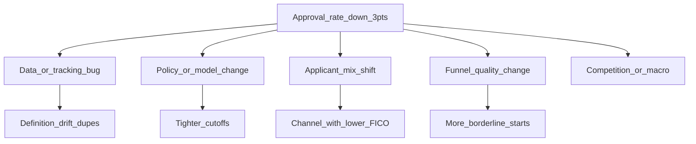

# Product Sense — Jenny Yang (PM)

**Panel:** ~45 min · 3–4 open questions + **10–12 min case study**

---

## Answer framework (every question)

1. **Clarify** — goal, segment, success metric, constraints (2–3 questions).
2. **Structure** — options, tradeoffs, recommendation.
3. **Metrics** — primary + guardrails.
4. **Execution** — experiment/rollout, risks, week 1 / month 1 reads.
5. **Close** — recap + what data would change your mind.

## CIRCLES (case studies)

| Step | Action |
|------|--------|
| **C**omprehend | Restate problem; ask clarifying questions |
| **I**dentify customer | Who benefits / who is harmed |
| **R**eport needs | Jobs-to-be-done, pain points |
| **C**ut | Prioritize 1–2 segments or goals |
| **L**ist solutions | 2–3 approaches |
| **E**valuate | Tradeoffs, metrics, risks |
| **S**ummarize | Clear recommendation + next step |

---

## Metrics cheat sheet

| Type | Examples |
|------|----------|
| **North star (growth)** | Funded loans, origination $, active borrowers |
| **Funnel** | Apply start, completion, approval, accept, fund |
| **Guardrails** | Default/loss, fraud, CAC payback, complaints, fair lending |
| **Experiment** | Primary metric, guardrails, MDE, duration, pre-registration |

---

## Timed case studies (12 min each — use a timer)

### Case 1: Approval rate dropped 3 pts WoW

**Prompt:** Personal loan approval rate fell from 42% to 39% week over week. What do you do?

**Clarifying questions to ask:**
- Same definition of approval (submitted vs. started)? Any tracking change?
- All channels/segments or one cohort?
- Any policy, model, or pricing deploy in the last 2 weeks?

**Hypothesis tree (talk through aloud):**

**Analysis plan (48 hours):**
1. Validate metric in dbt/BI — row counts, denominators, deploy log.
2. Decompose by channel, product, state, FICO band, campaign.
3. Compare approved vs. declined feature distributions (DTI, income, fraud flags).
4. Cross-check with risk: policy version, champion/challenger model.
5. Guardrails: volume, funded $, early delinquency proxy if available.

**Recommendation template:** "If mix-driven from a marketing campaign, don't loosen policy globally — tighten targeting or add pre-qual messaging. If policy-driven, quantify volume/loss tradeoff before rollback."

**Guardrails:** loss, fraud, volume, member NPS on decline experience.

---

### Case 2: Verify income earlier in the funnel?

**Prompt:** Risk wants income verification at apply start; PM worries about conversion.

**Clarify:** Which product? Required for all or high-risk segments only?

**Options:**

| Option | Pros | Cons |
|--------|------|------|
| Verify all at start | Lower fraud, better approvals | Conversion hit at top |
| Verify only high-risk segment | Balanced | Complexity, fairness review |
| Verify post-submit | Less top-of-funnel friction | Waste on declines, fraud later |

**Metrics:** Primary = fraud rate or loss proxy; Secondary = completion rate, time-to-fund; Guardrails = apply starts, approval rate by segment.

**Experiment:** Geo or % traffic holdout; 2–4 weeks; pre-register analysis plan.

**Close:** Recommend segmented post-submit verification unless fraud spike — then pilot early verify on highest-risk slice only.

---

### Open Q&A practice (say answers out loud, 2–3 min each)

**Q: How do you prioritize analytics when PM and risk disagree?**  
- Align on decision date and cost of wrong decision.  
- Frame as joint metric tree (growth + guardrails).  
- Propose smallest experiment or retrospective that resolves disagreement.  
- Escalate with quantified scenarios, not opinions.

**Q: How do you explain confidence intervals to a PM?**  
- "If we repeated this launch 100 times, ~95 of those outcomes would fall in this range."  
- Tie to decision: "Even at the low end, we're still positive on fund rate."

**Q: DS as strategic partner vs. order-taker?**  
- Proactive metric reviews; bring 2 options with tradeoffs.  
- Embed in roadmap planning; define success metrics before build.  
- Example: you flagged KPI definition issue before exec review (use your data quality story if natural).

---

## Questions to ask Jenny (pick 3–4)

1. How does Borrow DS influence roadmap vs. inform analyses after launch?
2. What's the biggest open tension: growth vs. risk vs. UX?
3. Where do KPI definitions still diverge across teams?
4. What does a great DS–PM partnership look like on your squad?
5. What product bet are you most excited about in the next two quarters?

---

## 12-minute timer checklist

- [ ] 0–2 min: Clarify + restate problem  
- [ ] 2–5 min: Structure (tree or options table)  
- [ ] 5–8 min: Metrics + experiment / rollout  
- [ ] 8–10 min: Risks + guardrails  
- [ ] 10–12 min: Summary + "what I'd validate first"
